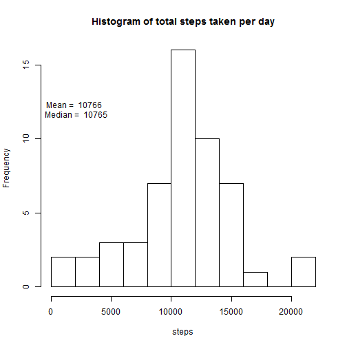
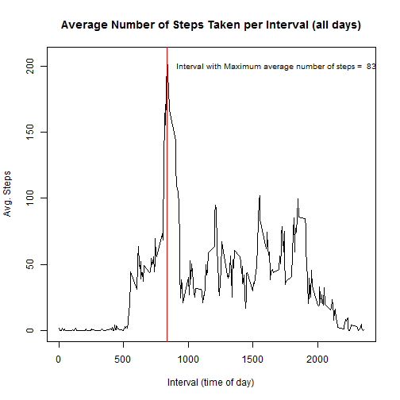
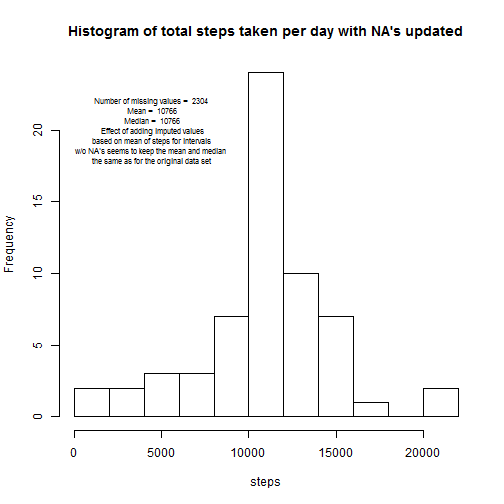
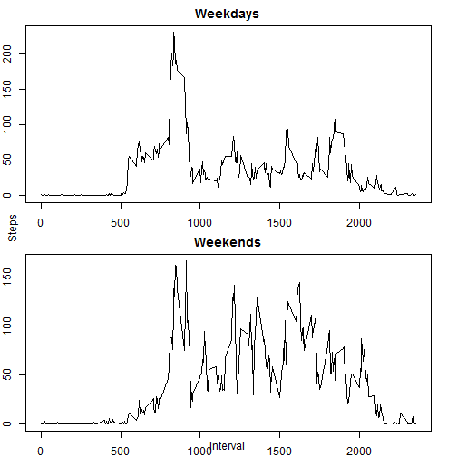

###Loading and preprocessing the data (change date values to be true dates (types)):

```r
# url <- "https://d396qusza40orc.cloudfront.net/repdata%2Fdata%2Factivity.zip"
# file <- "activity.zip"
# download.file(url, file)
# unzip(file)
dataFrame <- read.csv("activity.csv")
dataFrame$date <- as.Date(as.character(dataFrame$date), "%Y-%m-%d")
str(dataFrame)
```

```
## 'data.frame':	17568 obs. of  3 variables:
##  $ steps   : int  NA NA NA NA NA NA NA NA NA NA ...
##  $ date    : Date, format: "2012-10-01" "2012-10-01" ...
##  $ interval: int  0 5 10 15 20 25 30 35 40 45 ...
```

```r
head(dataFrame)
```

```
##   steps       date interval
## 1    NA 2012-10-01        0
## 2    NA 2012-10-01        5
## 3    NA 2012-10-01       10
## 4    NA 2012-10-01       15
## 5    NA 2012-10-01       20
## 6    NA 2012-10-01       25
```

```r
summary(dataFrame)
```

```
##      steps             date               interval     
##  Min.   :  0.00   Min.   :2012-10-01   Min.   :   0.0  
##  1st Qu.:  0.00   1st Qu.:2012-10-16   1st Qu.: 588.8  
##  Median :  0.00   Median :2012-10-31   Median :1177.5  
##  Mean   : 37.38   Mean   :2012-10-31   Mean   :1177.5  
##  3rd Qu.: 12.00   3rd Qu.:2012-11-15   3rd Qu.:1766.2  
##  Max.   :806.00   Max.   :2012-11-30   Max.   :2355.0  
##  NA's   :2304
```


###What is the mean number of steps taken per day (ignoring missing values)?
We need to aggregate the steps by date (ignoring interval). The aggregate function ignores/removes NA values by default for the sum function.

```r
totalStepsPerDay <- aggregate(data=dataFrame, cbind(steps) ~ date, sum)
meanSteps <- mean(totalStepsPerDay$steps)
medianSteps <- median(totalStepsPerDay$steps)

with(totalStepsPerDay, hist(steps, breaks=10, main="Histogram of total steps taken per day"))
text(2000, 12, paste("Mean = ", round(meanSteps), "\n Median = ", round(medianSteps)))
```



###What is the average daily activity pattern?
Now average across intervals

```r
avgStepsPerInterval <- aggregate(data=dataFrame, cbind(steps) ~ interval, mean)
intervalWithMaxSteps <- avgStepsPerInterval[avgStepsPerInterval$steps == max(avgStepsPerInterval$steps),]$interval
with(avgStepsPerInterval, plot(interval, steps, type="l", main="Average Number of Steps Taken per Interval (all days)", xlab="Interval (time of day)", ylab = "Avg. Steps"))
abline(v=intervalWithMaxSteps, col="red")
text(1700, 200, paste("Interval with Maximum average number of steps = ", intervalWithMaxSteps), cex=.8)
```



###Impute missing values in the original data set
Using the mean values of the intervals w/NA's removed from prior question

```r
dataFrameWithImputedValues <- data.frame(dataFrame)
rows<-subset(dataFrameWithImputedValues[is.na(dataFrameWithImputedValues$steps),], select=date:interval)
rowsUpdated <- merge(rows, avgStepsPerInterval)
for (row in 1:nrow(rowsUpdated)) {
  interval= rowsUpdated[row, 1]
  avgSteps = rowsUpdated[row, 3]
  date = rowsUpdated[row, 2]
  dataFrameWithImputedValues[dataFrameWithImputedValues$date==date &                               dataFrameWithImputedValues$interval==interval,]$steps=avgSteps
}
## roll up total steps by day with missing values imputed
totalStepsPerDayImputed <- 
  aggregate(data=dataFrameWithImputedValues, cbind(steps) ~ date, sum)
meanStepsImputed <- mean(totalStepsPerDayImputed$steps)
medianStepsImputed <- median(totalStepsPerDayImputed$steps)
with(totalStepsPerDayImputed, hist(steps, breaks=10, main="Histogram of total steps taken per day with NA's updated"))
text(4500, 20,paste("Number of missing values = ", round(length(rows$interval)), "\n Mean = ", round(meanStepsImputed), "\n Median = ", round(medianStepsImputed), "\n Effect of adding imputed values\n based on mean of steps for intervals \nw/o NA's seems to keep the mean and median \nthe same as for the original data set"), cex=0.7)
```



###Compare the differences between weekdays and weekends.
Are there differences (using the dataset with the imputed values)

```r
## add computed factor column indicating if date is weekend
dataFrameWithImputedValues$isWeekend <- ifelse(weekdays(dataFrameWithImputedValues$date) %in% c("Saturday", "Sunday"), TRUE, FALSE)
avgStepsPerIntervalImputedWeekdays <- aggregate(data=dataFrameWithImputedValues[dataFrameWithImputedValues$isWeekend==FALSE,], cbind(steps) ~ interval, mean)

avgStepsPerIntervalImputedWeekends <- aggregate(data=dataFrameWithImputedValues[dataFrameWithImputedValues$isWeekend==TRUE,], cbind(steps) ~ interval, mean)


## setup two-panel plot
par(mfrow=c(2,1), mar=c(2,2,2,2))
with(avgStepsPerIntervalImputedWeekdays, plot(interval, steps, type="l", main="Weekdays"))
with(avgStepsPerIntervalImputedWeekends, plot(interval, steps, type="l", main="Weekends"))
mtext("Steps", side=2, padj=2, outer=TRUE)
mtext("Interval", side=1, padj=-2, outer=TRUE)
```




